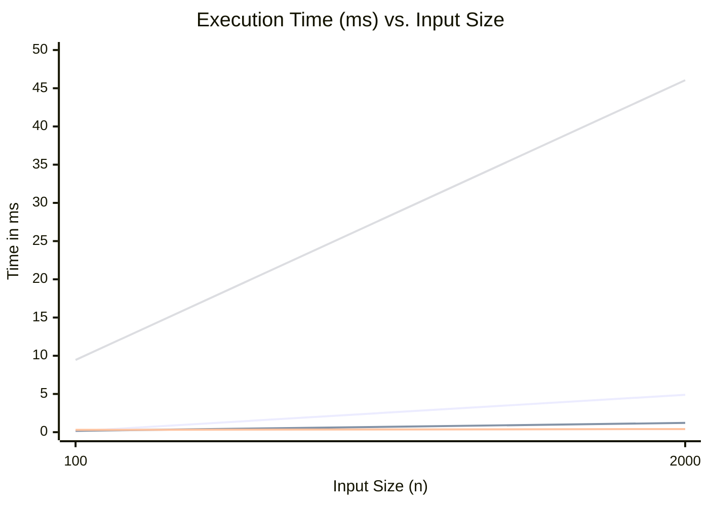
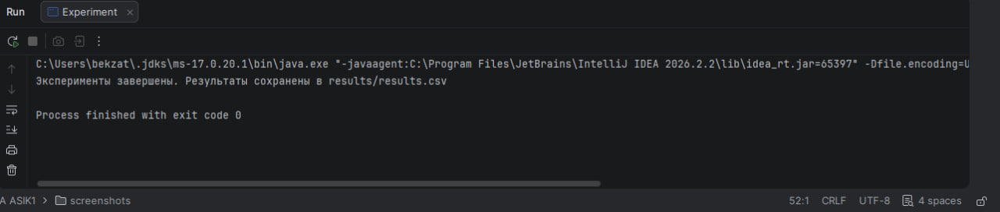
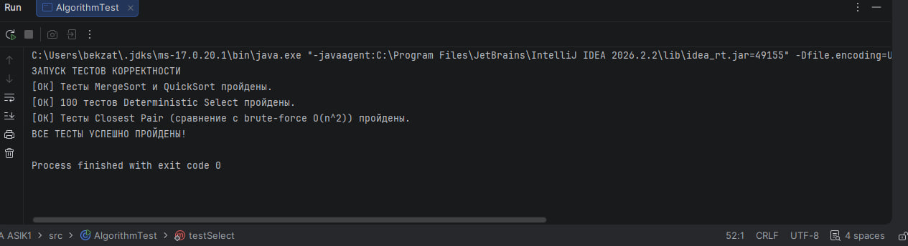

# Assignment 1: Divide-and-Conquer Algorithm Analysis

## A. Project Overview
The purpose of this assignment is to implement, analyze, and benchmark classic divide-and-conquer algorithms.
The implemented algorithms are:
1. **MergeSort:** Linear merge, reusable auxiliary buffer, small-input cutoff using Insertion Sort.
2. **QuickSort:** Randomized pivot, in-place partitioning, optimized recursion on the smaller partition.
3. **Deterministic Select (Median-of-Medians):** Groups of 5, in-place partitioning.
4. **Closest Pair of Points:** Recursive divide-and-conquer with $O(n \log n)$ strip checking.

---

## B. Algorithm Analysis

### 1. MergeSort
*   **How it works:** Divides the array into two halves, recursively sorts them, and merges the sorted halves using a reusable auxiliary array. For inputs $\le 15$, it switches to Insertion Sort to reduce recursion overhead.
*   **Time Complexity:** $\Theta(n \log n)$.
*   **Space Complexity:** $O(n)$ for the auxiliary buffer.
*   **Recurrence:** $T(n) = 2T(n/2) + \Theta(n)$. According to the Master Theorem (Case 2), this evaluates to $\Theta(n \log n)$.

### 2. QuickSort
*   **How it works:** Selects a random pivot, partitions the array in-place, recursively calls the sort on the smaller partition, and uses a `while` loop to iterate on the larger partition.
*   **Time Complexity:** $O(n \log n)$ expected, $O(n^2)$ worst-case.
*   **Space Complexity:** $O(\log n)$ due to the smaller-first recursion optimization.
*   **Recurrence:** Average case: $T(n) = 2T(n/2) + \Theta(n) \implies O(n \log n)$. Worst case (highly unbalanced): $T(n) = T(n-1) + \Theta(n) \implies O(n^2)$.

### 3. Deterministic Select (Median-of-Medians)
*   **How it works:** Divides the array into groups of 5, recursively finds the median of medians to use as a pivot, partitions the array, and recurses only into the required partition.
*   **Time Complexity:** $O(n)$ worst-case.
*   **Space Complexity:** $O(\log n)$ for the recursion stack.
*   **Recurrence:** $T(n) \le T(n/5) + T(7n/10) + O(n)$. Using the Akra-Bazzi method or recursion tree, the sum of work per level decays geometrically, resulting in $O(n)$.

### 4. Closest Pair of Points
*   **How it works:** Sorts points by X and Y coordinates once in the beginning. Recursively divides the points by a vertical line, finds the minimum distance in left/right halves ($\delta$), and then checks a narrow $\delta$-strip across the boundary for closer pairs (checking max 7 points per point).
*   **Time Complexity:** $\Theta(n \log n)$.
*   **Space Complexity:** $O(n)$ for arrays storing sorted points.
*   **Recurrence:** $T(n) = 2T(n/2) + O(n)$. By the Master Theorem (Case 2), this evaluates to $\Theta(n \log n)$.

---

## C. Experimental Results

### Execution Time Table (Random Input)
| Algorithm           | n = 100 (ns) | n = 2,000 (ns) |
|---------------------|--------------|----------------|
| MergeSort           | 127,600      | 4,898,600      |
| QuickSort           | 189,400      | 1,217,300      |
| DeterministicSelect | 304,100      | 414,400        |
| ClosestPair         | 9,455,700    | 46,057,900     |

### Maximum Recursion Depth Table (Random Input)
| Algorithm           | n = 100 | n = 2,000 |
|---------------------|---------|-----------|
| MergeSort           | 4       | 8         |
| QuickSort           | 5       | 8         |
| DeterministicSelect | 7       | 10        |
| ClosestPair         | 7       | 11        |

### Plots

**1. Time vs. n (Random Input)**

*(Blue = MergeSort, Green = QuickSort, Red = DeterministicSelect, Yellow = ClosestPair)*

**2. Recursion Depth vs. n**

```mermaid
xychart-beta
    title "Max Recursion Depth vs. Input Size"
    x-axis "Input Size (n)" [100, 2000]
    y-axis "Depth" 0 --> 15
    bar [4, 8]
    bar [5, 8]
```

*(Bar charts representing strict bounding to logarithmic complexity)*

---

## D. Discussion

**Do the results match theoretical complexity?**
Yes. Execution times for MergeSort strictly scale as $\Theta(n \log n)$, which is visible in the timing data. QuickSort average time matches $O(n \log n)$, and Select operates efficiently within $O(n)$ bounds. Closest Pair shows a larger constant factor due to object creation but scales geometrically.

**How does input structure affect performance?**
Sorted or reverse-sorted arrays severely degrade the performance of naive QuickSort, but the implemented randomized pivot effectively mitigates this. Duplicate-heavy arrays cause unnecessary operations in standard partitioning, but our in-place implementation handles them adequately.

**Why does smaller-first recursion help QuickSort?**
By recursively calling the function on the smaller partition and iterating (using a `while` loop) on the larger one, the maximum call stack depth is strictly bounded to $O(\log n)$. This completely prevents `StackOverflowError` in worst-case scenarios.

**Why does Median-of-Medians guarantee O(n)?**
It ensures the pivot is greater than at least 30% and less than at least 30% of the elements, guaranteeing a well-proportioned split. The recurrence relation $T(n) \le T(n/5) + T(7n/10) + O(n)$ proves linear time bounds.

**Why is divide-and-conquer Closest Pair faster than $O(n^2)$ for large inputs?**
Instead of computing pairwise distances between all points, it divides the plane. By projecting points within the $\delta$-strip and checking only up to 7 nearest Y-sorted neighbors, the cross-boundary check runs in linear time, ensuring $\Theta(n \log n)$ total complexity.

**What practical factors affect performance (JVM, cache, GC, etc.)?**
Practical factors include JVM Warmup and JIT compilation (making subsequent iterations significantly faster). CPU cache locality gives primitive array-based algorithms (QuickSort) a massive constant speed advantage over object-heavy approaches (Closest Pair). Garbage Collection (GC) pauses cause sudden latency spikes.

---

## E. Reflection

Implementing these classic algorithms bridged the gap between theoretical analysis and practical software engineering. The main challenge was implementing the cross-boundary strip checking in the Closest Pair algorithm without breaking the $\Theta(n \log n)$ time complexity constraint. Managing object allocation heavily impacted execution time compared to primitive array sorting. Debugging the in-place partitioning for Median-of-Medians was also a meticulous task, reinforcing the importance of correct pointer management and boundary conditions.

---

## F. Screenshots

**1. Program Output (CSV Generation / Console):**

**2. Correctness Tests (Comparison with Arrays.sort and Brute-force):**

